Check Regression Assumptions of Pilot Data
=================================================
This report graphs and runs tests to check the assumptions of the multiple regression.

<!--  Set the working directory to the repository's base directory; this assumes the report is nested inside of only one directory.-->

```r
opts_knit$set(root.dir = "../")  #Don't combine this call with any other chunk -especially one that uses file paths.
```


<!-- Set the report-wide options, and point to the external code file. -->

```r
require(knitr)
opts_chunk$set(
    results='show', 
    comment = NA, 
    tidy = FALSE,
    fig.width = 5.5, 
    fig.height = 4, 
    out.width = "600px", #This affects only the markdown, not the underlying png file.  The height will be scaled appropriately.
    fig.path = 'figure_rmd/',     
    dev = "png",
#     dev = "pdf",
    dpi = 400
)
echoChunks <- FALSE
options(width=120) #So the output is 50% wider than the default.
read_chunk("./Analysis/PilotRegression.R") 
```

<!-- Load the packages.  Suppress the output when loading packages. --> 


<!-- Load any Global functions and variables declared in the R file.  Suppress the output. --> 


<!-- Declare any global functions specific to a Rmd output.  Suppress the output. --> 


<!-- Load the datasets.   -->

```
 SubjectNumber PeerRatedBullying    Gender   ZScoresGender    PeerRatedDefensiveEgotism
 Min.   :101   Min.   :0.000     Male  :55   Min.   :-0.816   Min.   :0.000            
 1st Qu.:124   1st Qu.:0.000     Female:37   1st Qu.:-0.816   1st Qu.:0.550            
 Median :146   Median :0.250                 Median :-0.816   Median :0.840            
 Mean   :146   Mean   :0.298                 Mean   : 0.000   Mean   :0.838            
 3rd Qu.:169   3rd Qu.:0.395                 3rd Qu.: 1.213   3rd Qu.:1.070            
 Max.   :192   Max.   :1.670                 Max.   : 1.213   Max.   :1.730            
 ZScoresPeerRatedDefensiveEgotism ZGenderByZPeerDefensiveEgotism PeerRatedAssistsSupportsBully
 Min.   :-2.2341                  Min.   :-2.710                 Min.   :0.000                
 1st Qu.:-0.7801                  1st Qu.:-1.002                 1st Qu.:0.000                
 Median : 0.0075                  Median :-0.450                 Median :0.330                
 Mean   : 0.0000                  Mean   :-0.364                 Mean   :0.315                
 3rd Qu.: 0.6220                  3rd Qu.: 0.240                 3rd Qu.:0.395                
 Max.   : 2.3703                  Max.   : 1.910                 Max.   :1.330                
 TeacherRatedSocialAggression TeacherRatedDefensiveEgotism ZScoreTeacherRatedDefensiveEgotism
 Min.   :0.000                Min.   :0.000                Min.   :-1.023                    
 1st Qu.:0.000                1st Qu.:0.000                1st Qu.:-1.023                    
 Median :0.200                Median :0.330                Median :-0.346                    
 Mean   :0.303                Mean   :0.502                Mean   : 0.000                    
 3rd Qu.:0.400                3rd Qu.:0.807                3rd Qu.: 0.603                    
 Max.   :1.600                Max.   :1.750                Max.   : 2.533                    
 ZGenderByZTeacherDefesniveEgotism PeerRatedVictimOfBullying PeerRatedSelfEsteem ZScorePeerRatedSelfEsteem
 Min.   :-2.070                    Min.   :0.000             Min.   :0.47        Min.   :-3.287           
 1st Qu.:-1.240                    1st Qu.:0.000             1st Qu.:1.31        1st Qu.:-0.520           
 Median :-0.415                    Median :0.000             Median :1.50        Median : 0.103           
 Mean   :-0.317                    Mean   :0.206             Mean   :1.47        Mean   : 0.000           
 3rd Qu.: 0.420                    3rd Qu.:0.330             3rd Qu.:1.64        3rd Qu.: 0.556           
 Max.   : 2.460                    Max.   :2.000             Max.   :2.00        Max.   : 1.743           
 ZGenderByZPeerRatedSelfEsteem PeerRatedDefendsTheVictim
 Min.   :-3.990                Min.   :0.000            
 1st Qu.:-0.902                1st Qu.:0.330            
 Median :-0.205                Median :0.670            
 Mean   :-0.311                Mean   :0.643            
 3rd Qu.: 0.280                3rd Qu.:1.000            
 Max.   : 1.980                Max.   :1.670            
```


<!-- Tweak the datasets.   -->


## 1. Gender_PeerRatedDefensiveEgotism_PeerRatedBullying
*Gender, defensive egotism, and bullying.* We regressed peer-rated bullying (Column B in the Excel file, Will) onto gender (Column D), peer-rated defensive egotism (Column F), and the interaction term (Column G). 


```

Call:
lm(formula = PeerRatedBullying ~ 1 + Gender * PeerRatedDefensiveEgotism, 
    data = ds)

Residuals:
    Min      1Q  Median      3Q     Max 
-0.6470 -0.1746 -0.0624  0.1913  0.9961 

Coefficients:
                                       Estimate Std. Error t value Pr(>|t|)    
(Intercept)                              -0.132      0.121   -1.10    0.276    
GenderFemale                              0.262      0.168    1.56    0.122    
PeerRatedDefensiveEgotism                 0.538      0.119    4.52  1.9e-05 ***
GenderFemale:PeerRatedDefensiveEgotism   -0.467      0.196   -2.39    0.019 *  
---
Signif. codes:  0 '***' 0.001 '**' 0.01 '*' 0.05 '.' 0.1 ' ' 1

Residual standard error: 0.314 on 88 degrees of freedom
Multiple R-squared:  0.253,	Adjusted R-squared:  0.227 
F-statistic: 9.92 on 3 and 88 DF,  p-value: 1.06e-05
```

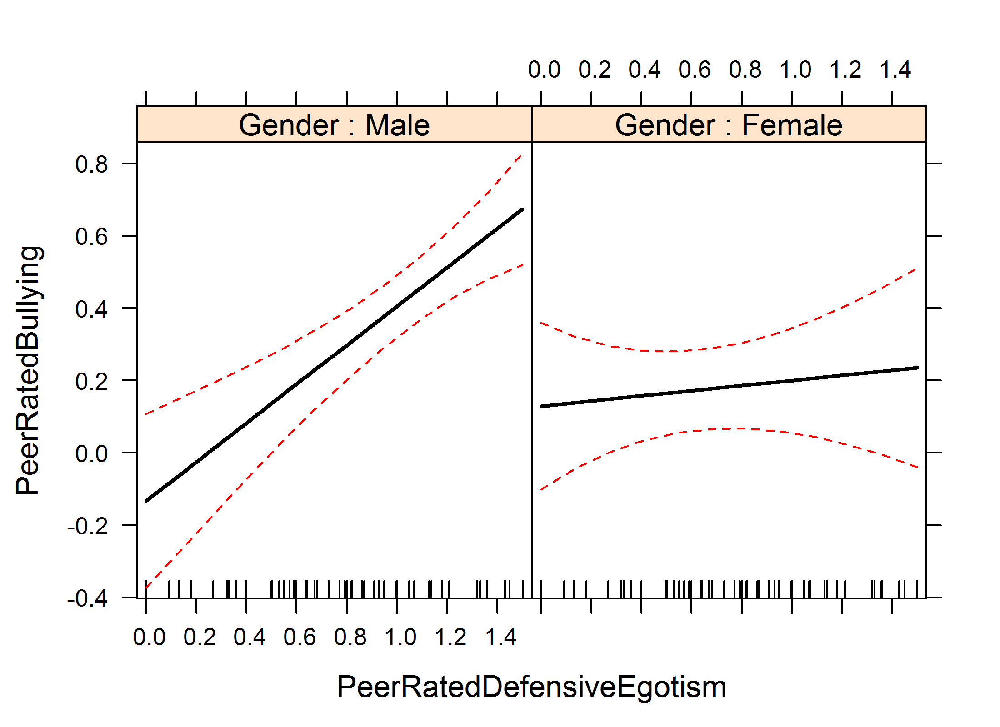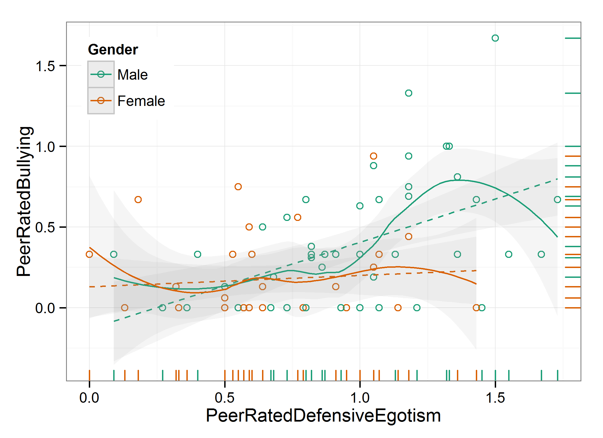


## 2. Gender_PeerRatedDefensiveEgotism_PeerRatedDefensiveEgotism
*Gender, defensive egotism, and assists or supports the bully.* When we re-ran the analyses above with peer-rated assists or supports the bully as the dependent variable (Column H, Will) (rather than peer-rated bullying), the pattern was almost identical to that in Figure 1. 


```

Call:
lm(formula = PeerRatedAssistsSupportsBully ~ 1 + Gender * PeerRatedDefensiveEgotism, 
    data = ds)

Residuals:
   Min     1Q Median     3Q    Max 
-0.646 -0.159 -0.068  0.161  0.814 

Coefficients:
                                       Estimate Std. Error t value Pr(>|t|)    
(Intercept)                             -0.0552     0.1080   -0.51    0.610    
GenderFemale                             0.1383     0.1497    0.92    0.358    
PeerRatedDefensiveEgotism                0.4839     0.1063    4.55  1.7e-05 ***
GenderFemale:PeerRatedDefensiveEgotism  -0.3368     0.1747   -1.93    0.057 .  
---
Signif. codes:  0 '***' 0.001 '**' 0.01 '*' 0.05 '.' 0.1 ' ' 1

Residual standard error: 0.281 on 88 degrees of freedom
Multiple R-squared:  0.29,	Adjusted R-squared:  0.265 
F-statistic:   12 on 3 and 88 DF,  p-value: 1.22e-06
```

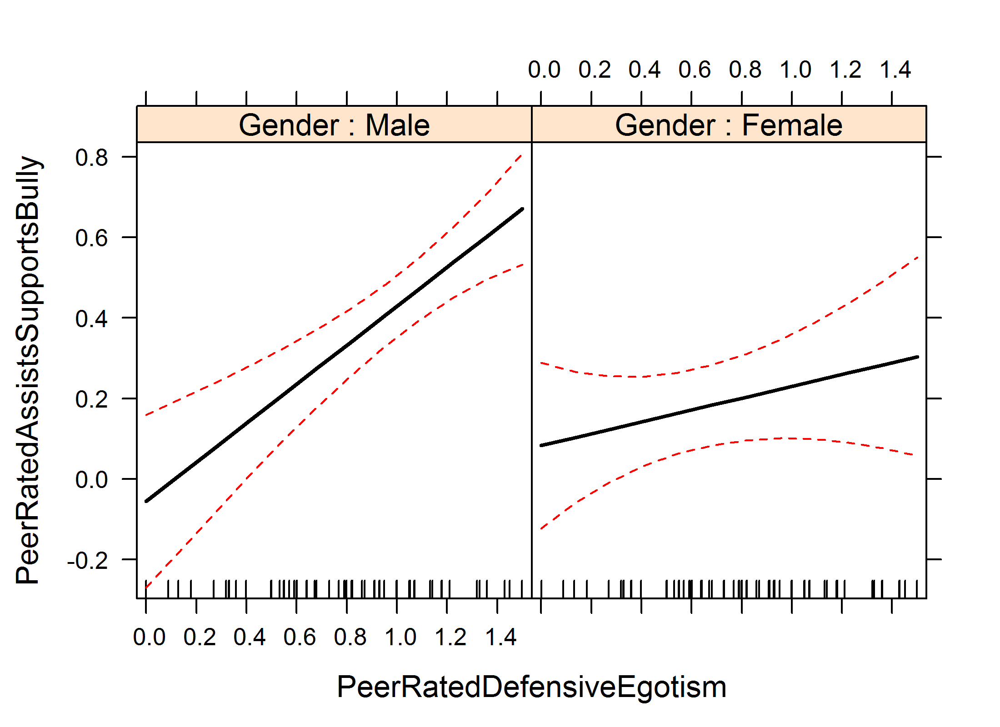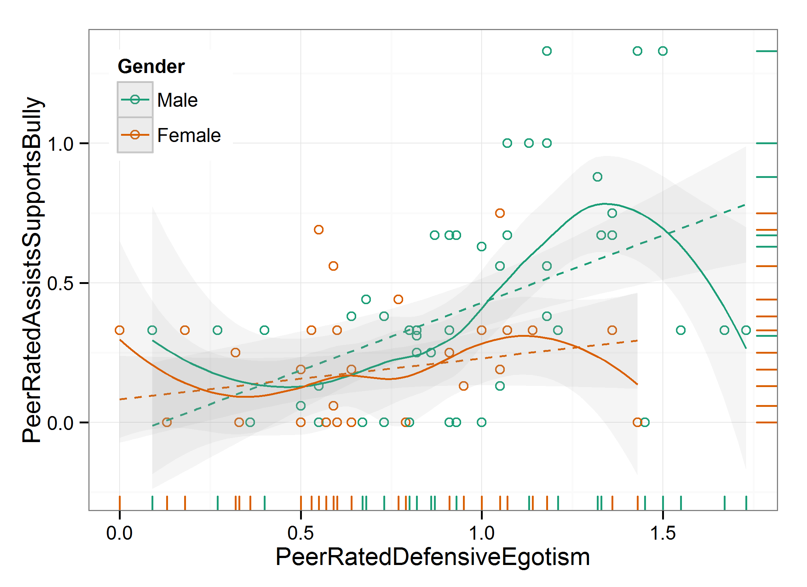


## 3. Gender_TeacherRatedDefensiveEgotism_TeacherRatedSocialAggression
*Gender, defensive egotism and social aggression.* We regressed teacher-rated social aggression (Column I, Will) onto gender (Column D), teacher-rated defensive egotism (Column K), and the interaction term (Column L), 


```

Call:
lm(formula = TeacherRatedSocialAggression ~ 1 + Gender * TeacherRatedDefensiveEgotism, 
    data = ds)

Residuals:
    Min      1Q  Median      3Q     Max 
-0.5077 -0.1520 -0.0111  0.0937  0.7864 

Coefficients:
                                          Estimate Std. Error t value Pr(>|t|)    
(Intercept)                                 0.0334     0.0558    0.60    0.551    
GenderFemale                               -0.0223     0.0773   -0.29    0.773    
TeacherRatedDefensiveEgotism                0.4743     0.0688    6.90  7.8e-10 ***
GenderFemale:TeacherRatedDefensiveEgotism   0.3358     0.1306    2.57    0.012 *  
---
Signif. codes:  0 '***' 0.001 '**' 0.01 '*' 0.05 '.' 0.1 ' ' 1

Residual standard error: 0.255 on 88 degrees of freedom
Multiple R-squared:  0.54,	Adjusted R-squared:  0.524 
F-statistic: 34.4 on 3 and 88 DF,  p-value: 8.46e-15
```

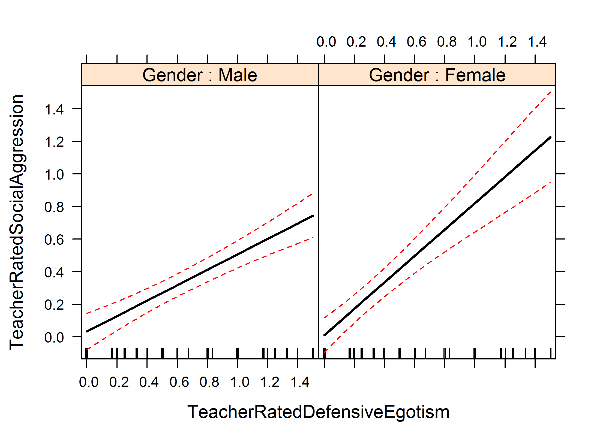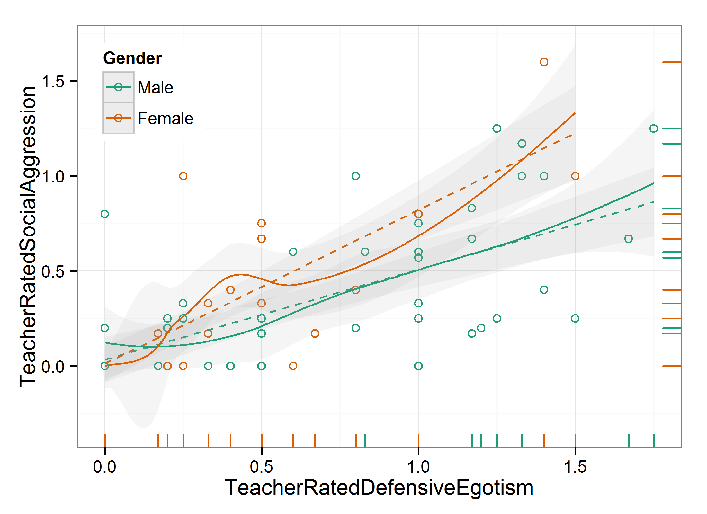


## 4. Gender_PeerRatedSelfEsteem_PeerRatedVictimOfBullying
*Gender, self-esteem and victim of bullying.* We regressed peer-rated victim of bullying (Column M) onto gender (Column D), peer-rated self-esteem (Column O), and the interaction term (Column P) 


```

Call:
lm(formula = PeerRatedVictimOfBullying ~ 1 + Gender * PeerRatedSelfEsteem, 
    data = ds)

Residuals:
    Min      1Q  Median      3Q     Max 
-0.7764 -0.1174 -0.0831  0.1490  1.4348 

Coefficients:
                                 Estimate Std. Error t value Pr(>|t|)    
(Intercept)                         1.230      0.208    5.91  6.4e-08 ***
GenderFemale                       -1.062      0.314   -3.38   0.0011 ** 
PeerRatedSelfEsteem                -0.621      0.132   -4.70  9.6e-06 ***
GenderFemale:PeerRatedSelfEsteem    0.579      0.216    2.69   0.0087 ** 
---
Signif. codes:  0 '***' 0.001 '**' 0.01 '*' 0.05 '.' 0.1 ' ' 1

Residual standard error: 0.288 on 88 degrees of freedom
Multiple R-squared:  0.246,	Adjusted R-squared:  0.221 
F-statistic: 9.58 on 3 and 88 DF,  p-value: 1.54e-05
```

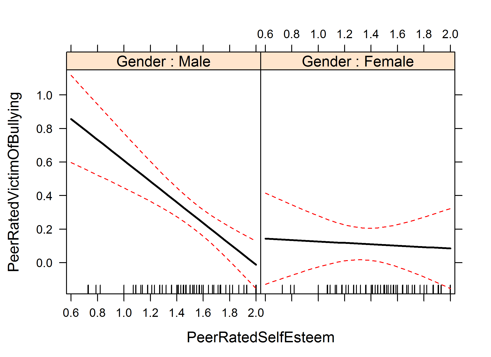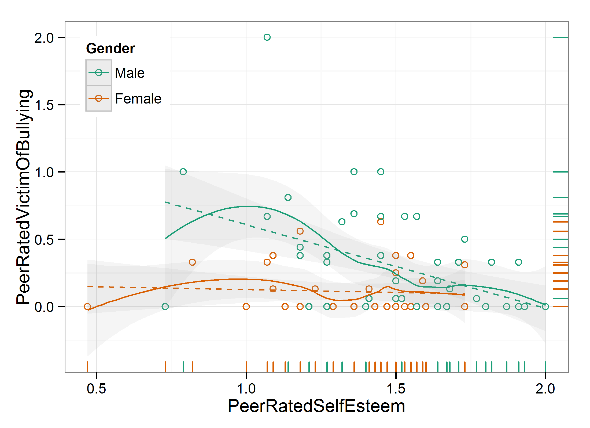


## 5. Gender_PeerRatedSelfEsteem_PeerRatedDefendsTheVictim
*Gender, self-esteem and defends the victim of bullying*. We regressed peer-rated defends the victim (Column Q) onto gender (Column D), peer-rated self-esteem (Column O), and the interaction term (Column P) 


```

Call:
lm(formula = PeerRatedDefendsTheVictim ~ 1 + Gender * PeerRatedSelfEsteem, 
    data = ds)

Residuals:
    Min      1Q  Median      3Q     Max 
-0.9901 -0.2645  0.0104  0.2561  0.9830 

Coefficients:
                                 Estimate Std. Error t value Pr(>|t|)  
(Intercept)                       -0.0401     0.2937   -0.14    0.892  
GenderFemale                      -0.1615     0.4436   -0.36    0.717  
PeerRatedSelfEsteem                0.4042     0.1866    2.17    0.033 *
GenderFemale:PeerRatedSelfEsteem   0.2846     0.3045    0.93    0.352  
---
Signif. codes:  0 '***' 0.001 '**' 0.01 '*' 0.05 '.' 0.1 ' ' 1

Residual standard error: 0.407 on 88 degrees of freedom
Multiple R-squared:  0.152,	Adjusted R-squared:  0.123 
F-statistic: 5.24 on 3 and 88 DF,  p-value: 0.00225
```

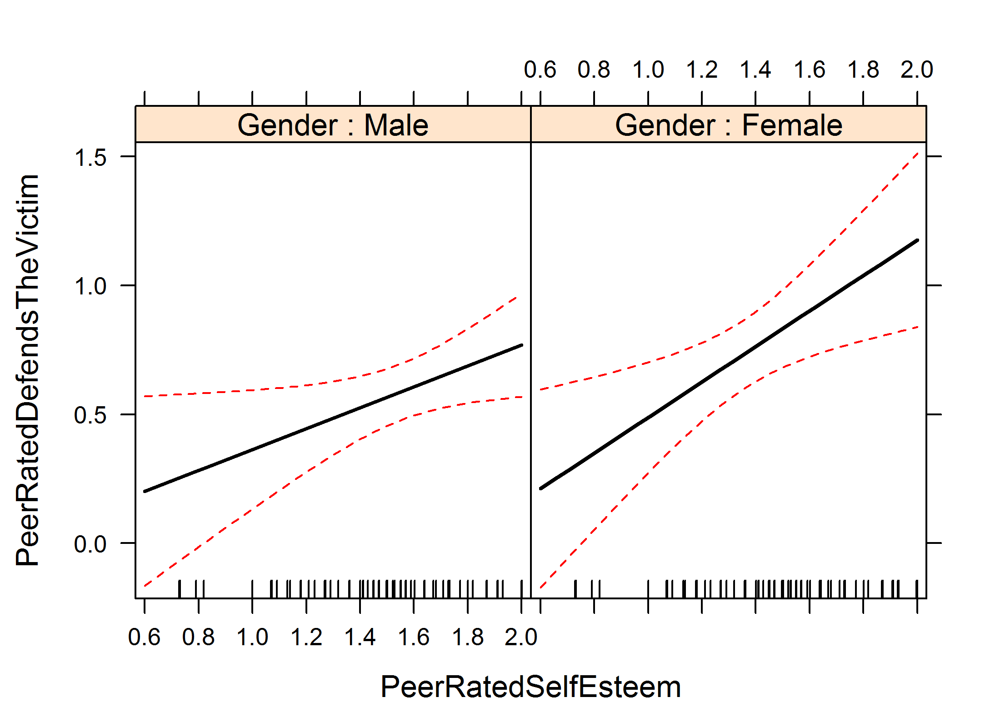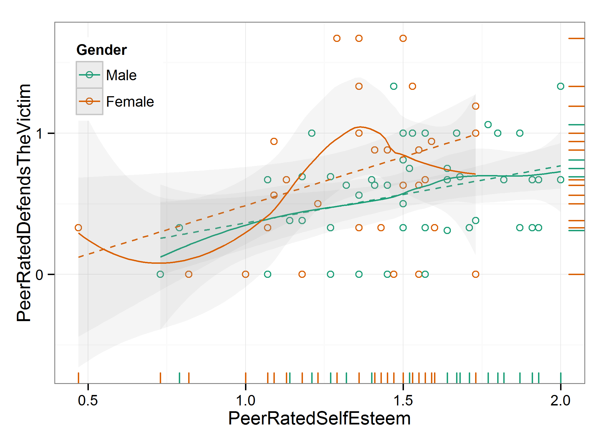


## Appendix. InteractionPlayground


```

Call:
lm(formula = ds$PeerRatedDefendsTheVictim ~ 1 + scale(as.numeric(ds$Gender)) * 
    scale(ds$PeerRatedDefensiveEgotism))

Residuals:
    Min      1Q  Median      3Q     Max 
-0.9485 -0.2598  0.0351  0.2465  0.9933 

Coefficients:
                                                                 Estimate Std. Error t value Pr(>|t|)    
(Intercept)                                                       0.67835    0.04795   14.15   <2e-16 ***
scale(as.numeric(ds$Gender))                                      0.08682    0.04883    1.78    0.079 .  
scale(ds$PeerRatedDefensiveEgotism)                               0.00278    0.04821    0.06    0.954    
scale(as.numeric(ds$Gender)):scale(ds$PeerRatedDefensiveEgotism)  0.09551    0.04911    1.94    0.055 .  
---
Signif. codes:  0 '***' 0.001 '**' 0.01 '*' 0.05 '.' 0.1 ' ' 1

Residual standard error: 0.427 on 88 degrees of freedom
Multiple R-squared:  0.0675,	Adjusted R-squared:  0.0357 
F-statistic: 2.12 on 3 and 88 DF,  p-value: 0.103
```

```

Call:
lm(formula = ds$PeerRatedDefendsTheVictim ~ 1 + ds$Gender * ds$ZScoresPeerRatedDefensiveEgotism)

Residuals:
    Min      1Q  Median      3Q     Max 
-0.9490 -0.2599  0.0359  0.2460  0.9933 

Coefficients:
                                                    Estimate Std. Error t value Pr(>|t|)    
(Intercept)                                           0.6074     0.0603   10.07  2.6e-16 ***
ds$GenderFemale                                       0.1759     0.0990    1.78    0.079 .  
ds$ZScoresPeerRatedDefensiveEgotism                  -0.0750     0.0606   -1.24    0.219    
ds$GenderFemale:ds$ZScoresPeerRatedDefensiveEgotism   0.1932     0.0996    1.94    0.056 .  
---
Signif. codes:  0 '***' 0.001 '**' 0.01 '*' 0.05 '.' 0.1 ' ' 1

Residual standard error: 0.427 on 88 degrees of freedom
Multiple R-squared:  0.0672,	Adjusted R-squared:  0.0354 
F-statistic: 2.11 on 3 and 88 DF,  p-value: 0.104
```

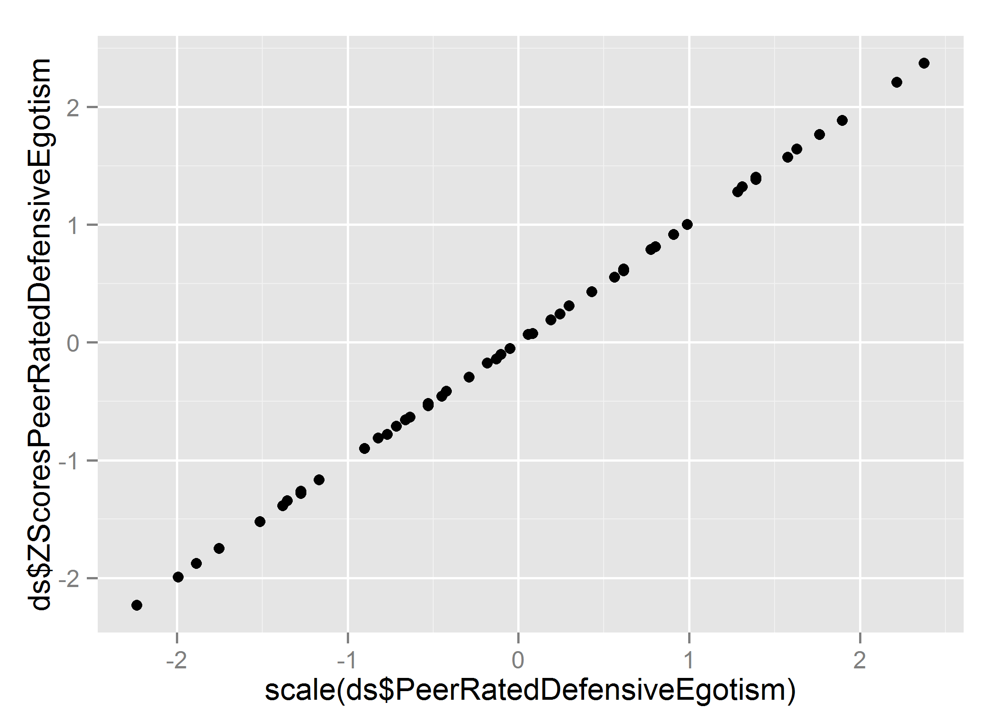


## Session Information
For the sake of documentation and reproducibility, the current report was build on a system using the following software.


```
Report created by Will at 2014-01-30, 10:21:40 -0600
```

```
R Under development (unstable) (2014-01-24 r64871)
Platform: x86_64-w64-mingw32/x64 (64-bit)

locale:
[1] LC_COLLATE=English_United States.1252  LC_CTYPE=English_United States.1252    LC_MONETARY=English_United States.1252
[4] LC_NUMERIC=C                           LC_TIME=English_United States.1252    

attached base packages:
[1] grid      stats     graphics  grDevices utils     datasets  methods   base     

other attached packages:
[1] effects_2.3-0      colorspace_1.2-4   lattice_0.20-24    ggplot2_0.9.3.1    scales_0.2.3       plyr_1.8.0.99     
[7] RColorBrewer_1.0-5 knitr_1.5         

loaded via a namespace (and not attached):
 [1] dichromat_2.0-0 digest_0.6.4    evaluate_0.5.1  formatR_0.10    gtable_0.1.2    labeling_0.2    MASS_7.3-29    
 [8] munsell_0.4.2   proto_0.3-10    Rcpp_0.10.6     reshape2_1.2.2  stringr_0.6.2   tools_3.1.0    
```

