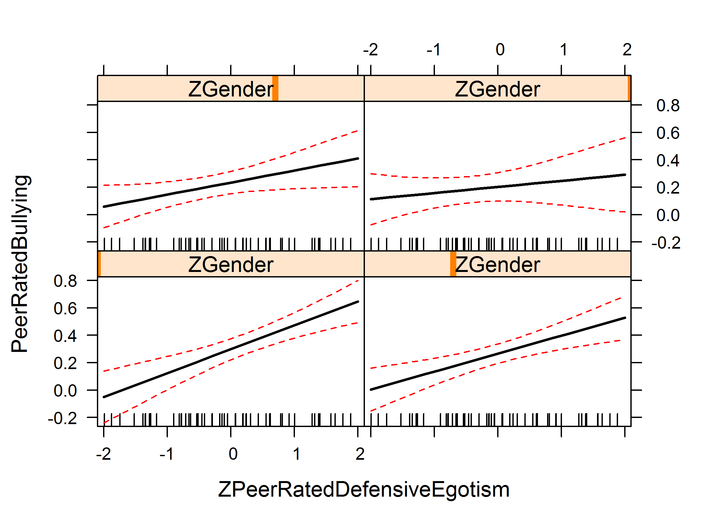
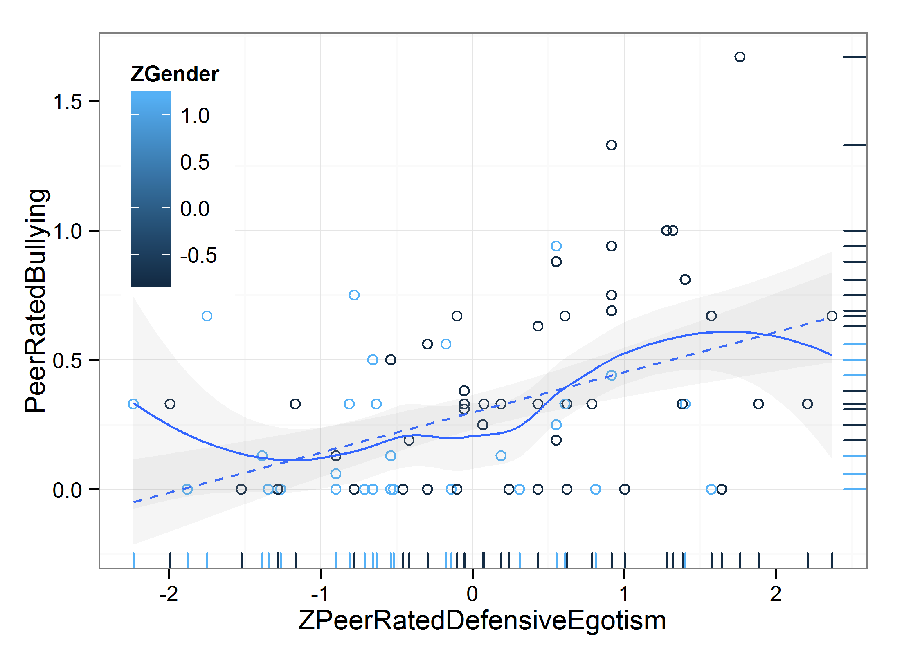
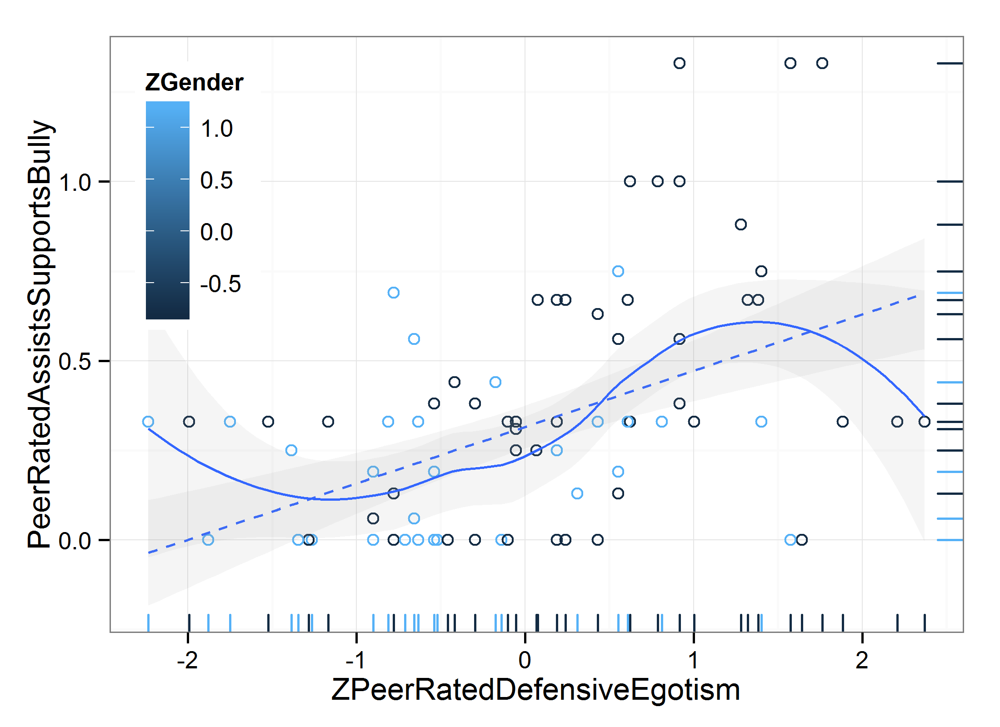
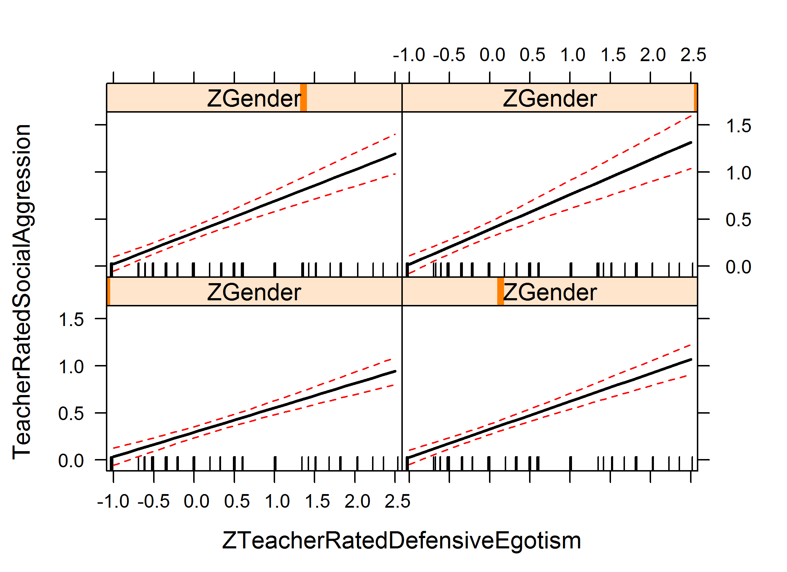
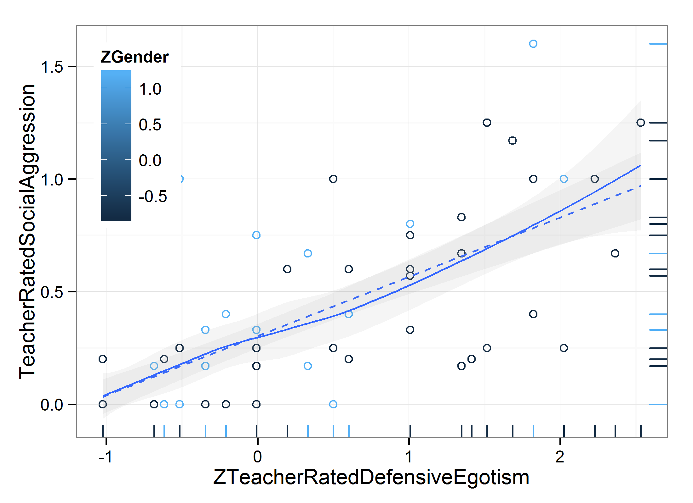
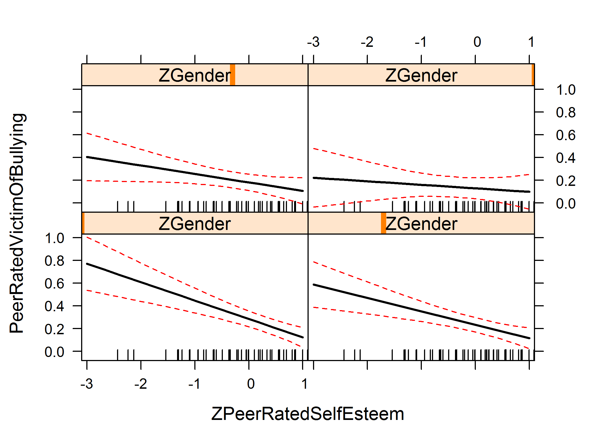
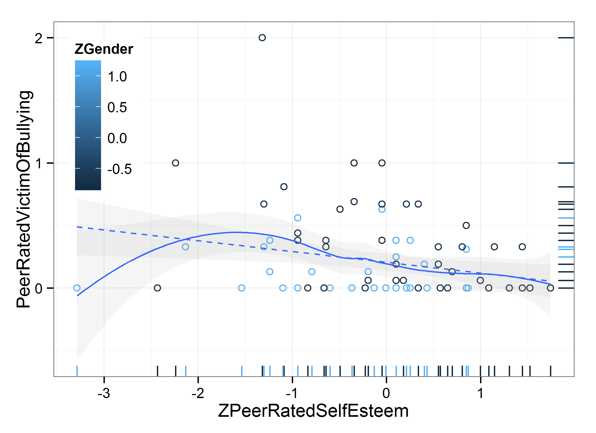
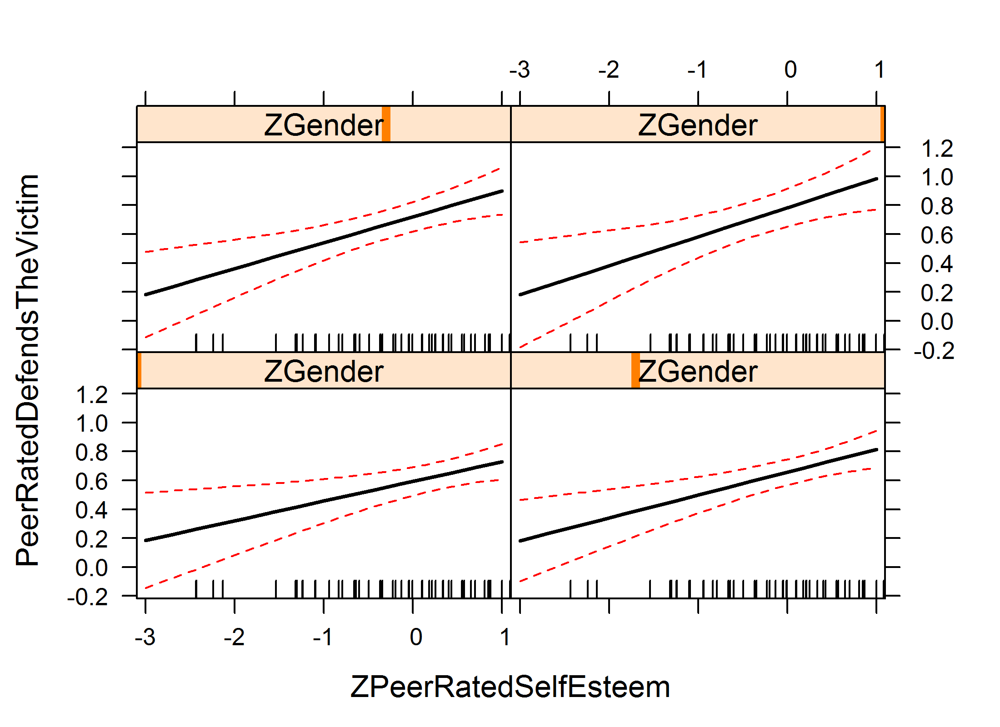
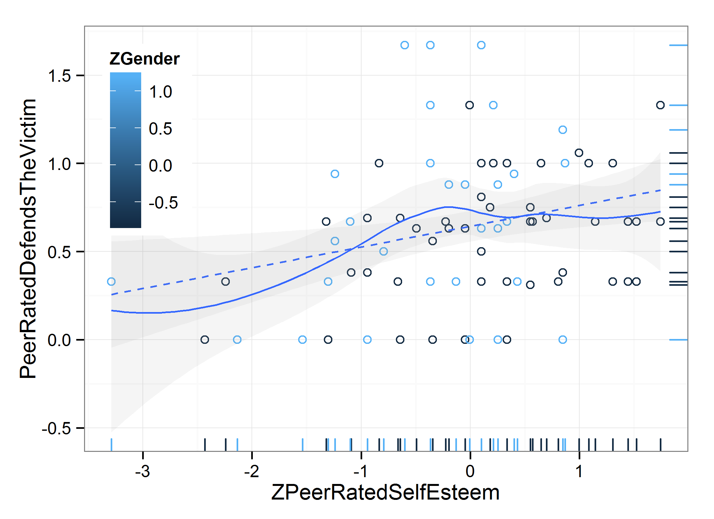

Check Regression Assumptions of Pilot Data -Standardized Predictors
=================================================
This report graphs and runs tests to check the assumptions of the multiple regression.

<!--  Set the working directory to the repository's base directory; this assumes the report is nested inside of only one directory.-->

```r
opts_knit$set(root.dir = "../")  #Don't combine this call with any other chunk -especially one that uses file paths.
```


<!-- Set the report-wide options, and point to the external code file. -->

```r
require(knitr)
opts_chunk$set(
    results='show', 
    comment = NA, 
    tidy = FALSE,
    fig.width = 5.5, 
    fig.height = 4, 
    out.width = "600px", #This affects only the markdown, not the underlying png file.  The height will be scaled appropriately.
    fig.path = 'figure_z/',     
    dev = "png",
#     dev = "pdf",
    dpi = 400
)
echoChunks <- FALSE
options(width=120) #So the output is 50% wider than the default.
read_chunk("./Analysis/PilotRegressionZ.R") 
```

<!-- Load the packages.  Suppress the output when loading packages. --> 


<!-- Load any Global functions and variables declared in the R file.  Suppress the output. --> 


<!-- Declare any global functions specific to a Rmd output.  Suppress the output. --> 


<!-- Load the datasets.   -->

```
 SubjectNumber PeerRatedBullying    Gender      ZGender       PeerRatedDefensiveEgotism ZPeerRatedDefensiveEgotism
 Min.   :101   Min.   :0.000     Male  :55   Min.   :-0.816   Min.   :0.000             Min.   :-2.2341           
 1st Qu.:124   1st Qu.:0.000     Female:37   1st Qu.:-0.816   1st Qu.:0.550             1st Qu.:-0.7801           
 Median :146   Median :0.250                 Median :-0.816   Median :0.840             Median : 0.0075           
 Mean   :146   Mean   :0.298                 Mean   : 0.000   Mean   :0.838             Mean   : 0.0000           
 3rd Qu.:169   3rd Qu.:0.395                 3rd Qu.: 1.213   3rd Qu.:1.070             3rd Qu.: 0.6220           
 Max.   :192   Max.   :1.670                 Max.   : 1.213   Max.   :1.730             Max.   : 2.3703           
 ZGenderByZPeerDefensiveEgotism PeerRatedAssistsSupportsBully TeacherRatedSocialAggression TeacherRatedDefensiveEgotism
 Min.   :-2.710                 Min.   :0.000                 Min.   :0.000                Min.   :0.000               
 1st Qu.:-1.002                 1st Qu.:0.000                 1st Qu.:0.000                1st Qu.:0.000               
 Median :-0.450                 Median :0.330                 Median :0.200                Median :0.330               
 Mean   :-0.364                 Mean   :0.315                 Mean   :0.303                Mean   :0.502               
 3rd Qu.: 0.240                 3rd Qu.:0.395                 3rd Qu.:0.400                3rd Qu.:0.807               
 Max.   : 1.910                 Max.   :1.330                 Max.   :1.600                Max.   :1.750               
 ZTeacherRatedDefensiveEgotism ZGenderByZTeacherDefensiveEgotism PeerRatedVictimOfBullying PeerRatedSelfEsteem
 Min.   :-1.023                Min.   :-2.070                    Min.   :0.000             Min.   :0.47       
 1st Qu.:-1.023                1st Qu.:-1.240                    1st Qu.:0.000             1st Qu.:1.31       
 Median :-0.346                Median :-0.415                    Median :0.000             Median :1.50       
 Mean   : 0.000                Mean   :-0.317                    Mean   :0.206             Mean   :1.47       
 3rd Qu.: 0.603                3rd Qu.: 0.420                    3rd Qu.:0.330             3rd Qu.:1.64       
 Max.   : 2.533                Max.   : 2.460                    Max.   :2.000             Max.   :2.00       
 ZPeerRatedSelfEsteem ZGenderByZPeerRatedSelfEsteem PeerRatedDefendsTheVictim
 Min.   :-3.287       Min.   :-3.990                Min.   :0.000            
 1st Qu.:-0.520       1st Qu.:-0.902                1st Qu.:0.330            
 Median : 0.103       Median :-0.205                Median :0.670            
 Mean   : 0.000       Mean   :-0.311                Mean   :0.643            
 3rd Qu.: 0.556       3rd Qu.: 0.280                3rd Qu.:1.000            
 Max.   : 1.743       Max.   : 1.980                Max.   :1.670            
```


<!-- Tweak the datasets.   -->


## 1. Gender_PeerRatedDefensiveEgotism_PeerRatedBullying
*Gender, defensive egotism, and bullying.* We regressed peer-rated bullying (Column B in the Excel file, Will) onto gender (Column D), peer-rated defensive egotism (Column F), and the interaction term (Column G). 


```

Call:
lm(formula = PeerRatedBullying ~ 1 + ZGender * ZPeerRatedDefensiveEgotism, 
    data = ds)

Residuals:
    Min      1Q  Median      3Q     Max 
-0.6499 -0.1748 -0.0615  0.1900  0.9957 

Coefficients:
                                   Estimate Std. Error t value Pr(>|t|)    
(Intercept)                          0.2661     0.0353    7.54    4e-11 ***
ZGender                             -0.0641     0.0359   -1.78  0.07812 .  
ZPeerRatedDefensiveEgotism           0.1311     0.0355    3.69  0.00038 ***
ZGender:ZPeerRatedDefensiveEgotism  -0.0867     0.0362   -2.40  0.01872 *  
---
Signif. codes:  0 '***' 0.001 '**' 0.01 '*' 0.05 '.' 0.1 ' ' 1

Residual standard error: 0.314 on 88 degrees of freedom
Multiple R-squared:  0.253,	Adjusted R-squared:  0.228 
F-statistic: 9.94 on 3 and 88 DF,  p-value: 1.03e-05
```




## 2. Gender_PeerRatedDefensiveEgotism_PeerRatedDefensiveEgotism
*Gender, defensive egotism, and assists or supports the bully.* When we re-ran the analyses above with peer-rated assists or supports the bully as the dependent variable (Column H, Will) (rather than peer-rated bullying), the pattern was almost identical to that in Figure 1. 


```

Call:
lm(formula = PeerRatedAssistsSupportsBully ~ 1 + ZGender * ZPeerRatedDefensiveEgotism, 
    data = ds)

Residuals:
    Min      1Q  Median      3Q     Max 
-0.6491 -0.1593 -0.0668  0.1603  0.8130 

Coefficients:
                                   Estimate Std. Error t value Pr(>|t|)    
(Intercept)                          0.2924     0.0315    9.27  1.1e-14 ***
ZGender                             -0.0712     0.0321   -2.22    0.029 *  
ZPeerRatedDefensiveEgotism           0.1307     0.0317    4.12  8.5e-05 ***
ZGender:ZPeerRatedDefensiveEgotism  -0.0626     0.0323   -1.94    0.056 .  
---
Signif. codes:  0 '***' 0.001 '**' 0.01 '*' 0.05 '.' 0.1 ' ' 1

Residual standard error: 0.281 on 88 degrees of freedom
Multiple R-squared:  0.29,	Adjusted R-squared:  0.266 
F-statistic:   12 on 3 and 88 DF,  p-value: 1.19e-06
```




## 3. Gender_TeacherRatedDefensiveEgotism_TeacherRatedSocialAggression
*Gender, defensive egotism and social aggression.* We regressed teacher-rated social aggression (Column I, Will) onto gender (Column D), teacher-rated defensive egotism (Column K), and the interaction term (Column L), 


```

Call:
lm(formula = TeacherRatedSocialAggression ~ 1 + ZGender * ZTeacherRatedDefensiveEgotism, 
    data = ds)

Residuals:
    Min      1Q  Median      3Q     Max 
-0.5971 -0.1531 -0.0081  0.0893  0.7956 

Coefficients:
                                      Estimate Std. Error t value Pr(>|t|)    
(Intercept)                             0.3265     0.0279   11.69   <2e-16 ***
ZGender                                 0.0635     0.0285    2.23    0.029 *  
ZTeacherRatedDefensiveEgotism           0.2967     0.0288   10.30   <2e-16 ***
ZGender:ZTeacherRatedDefensiveEgotism   0.0741     0.0305    2.43    0.017 *  
---
Signif. codes:  0 '***' 0.001 '**' 0.01 '*' 0.05 '.' 0.1 ' ' 1

Residual standard error: 0.251 on 88 degrees of freedom
Multiple R-squared:  0.552,	Adjusted R-squared:  0.537 
F-statistic: 36.2 on 3 and 88 DF,  p-value: 2.47e-15
```




## 4. Gender_PeerRatedSelfEsteem_PeerRatedVictimOfBullying
*Gender, self-esteem and victim of bullying.* We regressed peer-rated victim of bullying (Column M) onto gender (Column D), peer-rated self-esteem (Column O), and the interaction term (Column P) 


```

Call:
lm(formula = PeerRatedVictimOfBullying ~ 1 + ZGender * ZPeerRatedSelfEsteem, 
    data = ds)

Residuals:
    Min      1Q  Median      3Q     Max 
-0.7779 -0.1165 -0.0835  0.1494  1.4327 

Coefficients:
                             Estimate Std. Error t value Pr(>|t|)    
(Intercept)                    0.2330     0.0317    7.35  9.7e-11 ***
ZGender                       -0.1039     0.0322   -3.23  0.00173 ** 
ZPeerRatedSelfEsteem          -0.1180     0.0319   -3.70  0.00037 ***
ZGender:ZPeerRatedSelfEsteem   0.0872     0.0324    2.69  0.00850 ** 
---
Signif. codes:  0 '***' 0.001 '**' 0.01 '*' 0.05 '.' 0.1 ' ' 1

Residual standard error: 0.288 on 88 degrees of freedom
Multiple R-squared:  0.246,	Adjusted R-squared:  0.22 
F-statistic: 9.57 on 3 and 88 DF,  p-value: 1.55e-05
```




## 5. Gender_PeerRatedSelfEsteem_PeerRatedDefendsTheVictim
*Gender, self-esteem and defends the victim of bullying*. We regressed peer-rated defends the victim (Column Q) onto gender (Column D), peer-rated self-esteem (Column O), and the interaction term (Column P) 


```

Call:
lm(formula = PeerRatedDefendsTheVictim ~ 1 + ZGender * ZPeerRatedSelfEsteem, 
    data = ds)

Residuals:
    Min      1Q  Median      3Q     Max 
-0.9890 -0.2649  0.0084  0.2556  0.9856 

Coefficients:
                             Estimate Std. Error t value Pr(>|t|)    
(Intercept)                    0.6569     0.0447   14.69  < 2e-16 ***
ZGender                        0.1268     0.0454    2.79  0.00640 ** 
ZPeerRatedSelfEsteem           0.1579     0.0450    3.51  0.00071 ***
ZGender:ZPeerRatedSelfEsteem   0.0431     0.0457    0.94  0.34842    
---
Signif. codes:  0 '***' 0.001 '**' 0.01 '*' 0.05 '.' 0.1 ' ' 1

Residual standard error: 0.407 on 88 degrees of freedom
Multiple R-squared:  0.152,	Adjusted R-squared:  0.123 
F-statistic: 5.24 on 3 and 88 DF,  p-value: 0.00224
```




## Session Information
For the sake of documentation and reproducibility, the current report was build on a system using the following software.


```
Report created by Will at 2014-02-01, 10:39:55 -0600
```

```
R Under development (unstable) (2014-01-24 r64871)
Platform: x86_64-w64-mingw32/x64 (64-bit)

locale:
[1] LC_COLLATE=English_United States.1252  LC_CTYPE=English_United States.1252    LC_MONETARY=English_United States.1252
[4] LC_NUMERIC=C                           LC_TIME=English_United States.1252    

attached base packages:
[1] grid      stats     graphics  grDevices utils     datasets  methods   base     

other attached packages:
[1] effects_2.3-0      colorspace_1.2-4   lattice_0.20-24    ggplot2_0.9.3.1    scales_0.2.3       plyr_1.8.0.99     
[7] RColorBrewer_1.0-5 knitr_1.5         

loaded via a namespace (and not attached):
 [1] dichromat_2.0-0 digest_0.6.4    evaluate_0.5.1  formatR_0.10    gtable_0.1.2    labeling_0.2    MASS_7.3-29    
 [8] munsell_0.4.2   proto_0.3-10    Rcpp_0.10.6     reshape2_1.2.2  stringr_0.6.2   tools_3.1.0    
```

